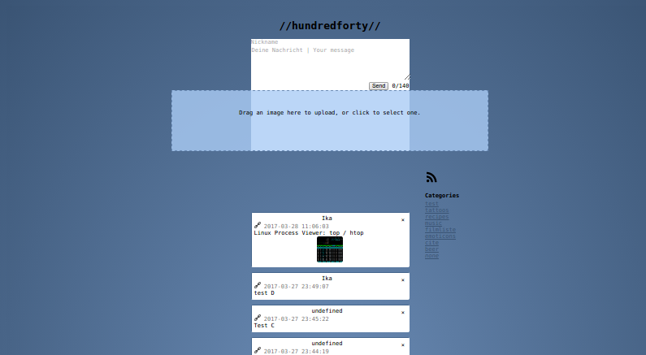

# hundredforty

This is a simple note remembererererererer.





Todos:
 * Write docs for the create-script.
 * Write docs for the delete-script.
 * Write docs for the list-script.
 * Write docs for the get-script.
 * Write docs for the main.js file.
 * Bug: If note is deleted then loading more fails about one record.
 * Hashtag search.
 * URL shortener.
 * Handle generic file uploads that do not return thumbnails.

Files
-----
 .category_blacklist
 This file contains a category blacklist. Each line specifies a
 wildcard for category names that shall not be listet in the interface.
 ```text
   %secret-category%
   %do-not-show%
 ```

 .env
 This file contains a basic configuration.
 ```text
   LINK_BASE=http://yourdomain.com/sub/directory/
 ```

 config.js (edit to your needs)
 ```javascript
    _DISPLAY_LIMIT        = 7;

    _ALLOW_FILE_UPLOADS   = true;
    _IMAGE_URL_BASE       = 'https://yourserver.com';
    _UPLOAD_URL           = _IMAGE_URL_BASE + '/ajax/imageupload.ajax.php';
  ```
 
 ./database/.env
 This file should contain your DB credentials
```text
  APP_KEY=SomeRandomString
  DB_USERNAME=
  DB_PASSWORD=
  DB_DATABASE=
  DB_HOST=
```

Include the script
------------------


HTML
----
```html
    <div id="hundredforty">
      <h1>//hundredforty//</h1>
         <div id="input-container">
	    <div id="author-container"><input type="text" id="author" placeholder="Nickname" maxlen="16" /></div>
            <textarea id="note-text" maxlength="140" placeholder="Deine Nachricht | Your message"></textarea><br/>
            <div id="sub-input">
               <button id="btn-sendnote">Send</button>
               <span id="textlength">0</span>/140
            </div>
            <div id="upload-widget" class="dropzone"></div>
         </div>
         <div id="loading-send" class="invisible"></div>
         <div id="error-status"></div>
         <div id="category-list">
            <h4>Categories</h4>
            <ul></ul>
         </div>
      
         <!-- Invisible by default -->
         <div id="dialog" class="no-display"></div>

         <button id="btn-loadnew">Load new</button>
      
         <div id="notes">
            <div id="_template-note" class="note-container hidden">
               <a class="boxclose"></a>
	       <div id="_template-author" class="note-author"></div>
               <div id="_template-date" class="note-date"></div>
               <div id="_template-data" class="note-data dont-break-out"></div>
               <div id="_template-media"></div>
            </div>
         </div>
         <button id="btn-more">Load more</button>
         <div id="loading-more" class="invisible"></div>
   </div>
```

Changelog
=========
[2017-04-26, Ika, v1.1.2]
 * Added the search bar.
 
[2017-04-12, Ika, v1.1.1]
 * The uploaded does not support non-image files, too.
   (using the Free-file-icons theme 
     https://github.com/teambox/Free-file-icons).

[2017-03-28, Ika, v1.1.0]
 * Added an 'author' field [string(64)].
 * Optimized the blue theme.

[2017-02-25, Ika, v1.0.9]
 * Added a simple URL shortener. See _SHORTEN_URLS and
   _URL_SHORTENER in the js/main.js file (near line 31).
 * Fixed the 'no whitespace before links'-linkify issue by
   adding '\n' to the lines 31 and 32 of
   jquery-linkify.js.

[2017-02-19, Ika, v1.0.8]
 * Added the RSS icon plus link to the current feed.

[2017-02-12, Ika, v1.0.7]
 * Added a simple RSS feed in ./rss/

[2017-01-23, Ika, v1.0.6]
 * Now storing the image-url-base in the database, too.

[2017-01-16, Ika, v1.0.5]
 * Added image uploads.
 * Added the 'referrer' field to the database.

[2017-01-08, Ika, v1.0.4]
 * Added a category listing hook: ajax/categories.ajax.php.
 * Added a category blacklist in the file '.category_blacklist'.
 * Displaying categories on the frontend.

[2017-01-07, Ika, v1.0.3]
 * Added a new column to the notes database: 'image_refs'.
 * Added a HTTP method check to the create-note script.
 * Changed the create-note method from GET to POST.
 * Prepared image URL uploads.

[2017-01-06, Ika, v1.0.2]
 * Added a 'There are new notes' button which loads new
   available records at the top of the list.

[2017-01-05, Ika]
 * Additionally returning the 'created_at' field as a UNIX timestamp in the
   AJAX scripts.
 * Added a new AJAX script: checknew.ajax.php.

[2016-12-13, Ika]
 * Added 'category' and hash (sha256) fields.

[2016-12-06, Ika]
 * Added a 'delete' hook for deleting notes.

[2016-12-01, Ika]
 * Created the base files and PDO setup ('Eloquent').
 * Note class location is /app/database/models/Note.php